<p align="center">
  
</p>

# OOBE:Fe

A set of small instruments that share one chassis.

Every one of them does a real job on real files, says what it measured rather than what it guessed, and refuses to pretend. They look like laboratory hardware because they behave like it: stamped metal for the machine, recessed glass for anything that is a number, and four heat tiers that carry every warning in the app so a red edge always means the same thing.

> [!NOTE]
> This repository holds **downloads and nothing else**. There is no source here.

---

## Downloads

| | Platform | Where |
|---|---|---|
| **OOBE:Fe Lite** | Windows 10 or later, 64 bit | [Releases](../../releases) |
| **OOBE:Nd N42** | Android 9 or later | [oobe-fe-mobile-releases](https://github.com/HelyerAnArgh/oobe-fe-mobile-releases/releases) |

> [!TIP]
> **The phone build lives in its own repository now.** Everything mobile is at [oobe-fe-mobile-releases](https://github.com/HelyerAnArgh/oobe-fe-mobile-releases), including its own downloads, notes, scans and updates.

---

## OOBE:Fe Lite

<p align="center">
  
  <br><sub>Example image. The library shown is generated, not a real collection.</sub>
</p>

| Module | Does |
|---|---|
| **Nd** | Plays your music, and measures it |
| **Ge** | Shows you where your disk space went |
| **Li** | Reads a plugged in phone, and only ever reads |

### Nd, the music module

**A ten band graphic EQ**, because Windows Media Player 11 had ten and muscle memory is real. Shelves at the ends, bells in the middle, eight presets, and double click a band to zero it.

> [!TIP]
> **Quiet Mode is a real compressor**, not a checkbox that does nothing. Measured at **14.4 dB** of gain reduction on loud material and exactly **0.00 dB** when it is off.

**The seek bar is the real envelope of the track**, 900 buckets measured from the audio and drawn as 182 bars, downsampled by maximum and never by average, because averaging drags every transient towards the mean until the whole thing looks like a sausage.

**It measures your library and tells you the bad news.** One pass gives every track its replay gain, its dynamic range and whether it clips. A real 1,256 track library came back at **mean DR7.9** with **326 tracks** holding samples over full scale, which is a sentence about the loudness war rather than about this app.

**It plays the video hiding inside an mp3.** The container decides, never the extension, so a file named `.mp3` that is secretly MP4 simply works and the readout says `REALLY MP4` about it.

**Twelve smart lists, which are questions rather than folders.** Rate a five star track down to two and it leaves Favourites while you watch, because there is nothing stored to go stale.

**Deep listening statistics**, including a weekday by hour heatmap of 168 cells, because *when* you listen is a two dimensional fact and one line of totals throws half of it away.

### Ge, this machine

The brief was WinDirStat but better, so the design is mostly a list of things WinDirStat gets wrong.

| Fault | What it costs you | What Ge does |
|---|---|---|
| **Follows junctions** | `C:\Users\All Users` points at `C:\ProgramData`, so it is counted twice, and a junction pointing at an ancestor never finishes | Reparse points are detected, counted where they stand, and never entered |
| **Gives up past 260 characters** | Deep paths are silently missing from the total | Roots become verbatim paths, which lifts the limit for everything beneath them |
| **Hides what it could not read** | A denied system folder simply is not in the number, with nothing saying so | Denials are counted and shown |
| **Single threaded** | A walk is almost pure waiting on the disk, so one thread leaves most of it idle | A pool of workers over a shared queue |

On a real profile that is **1,840,522 files across 298,166 directories, 414.65 GB, in 62.3 seconds**. About 29,500 files a second, with **77 junctions found and not followed** and **16 denied directories counted rather than quietly dropped**.

> [!TIP]
> **The duplicate finder does not hash, and that is the point.** Three stages, each more expensive than the last so the costly one only sees what survived: file size, then the first 8 kB, then **every byte**. A hash answers a subtly different question, *these files probably match*, with a collision chance nobody ever puts on screen. There is going to be a delete button next to this answer one day, and "probably identical" is not a basis for deleting somebody's file.

**The empty folder finder has one genuinely dangerous case**, so it is handled explicitly: a folder holding nothing but a junction has a file count of zero and is not remotely empty. Only the topmost folder of a nest is reported, with a count of what is under it, because a build tree left behind as three hundred nested empty folders is one thing to deal with rather than three hundred.

**The machine readout is read, never computed.** Windows version, processor, memory, graphics adapters, uptime, and every physical disk mapped to the volumes actually on it, because *which disk is C: really on* is the question a storage tool gets asked. No WMI anywhere, and it needs no administrator.

### Li, a plugged in phone

Plug an Android phone in and the cable becomes a themed, sortable, thumbnailed file browser that can answer "what on earth is eating my storage".

> [!IMPORTANT]
> **Read only, permanently.** There is exactly one transfer in the whole module and it goes one way, phone to PC. No delete, no rename, no push. That is a deliberate boundary rather than an unfinished feature: a half built file explorer is the last thing that should be allowed to delete anything.

Two ways in, and it picks for itself.

> [!NOTE]
> **MTP** is what Windows already uses when you plug a phone in and it appears in File Explorer. Nothing to install, and it is on every machine. The catch is that it reads the phone's **media database** rather than the filesystem, so anything the phone has not indexed can simply refuse to appear.
>
> **ADB** is Google's own Android Debug Bridge, the tool Android development is built on. It reads the **filesystem directly**, which is why it is faster, sees files that are not media, and never goes stale.

| | MTP | ADB |
|---|---|---|
| Needs setting up | Nothing at all | Platform tools on the PC, USB debugging on the phone |
| Sees files that are not media | Only if indexed | Yes |
| Whole phone scan | 94 seconds | **3.5 seconds** |

MTP is the baseline because it is always there. ADB is optional and auto detected and only ever makes things better, so it still works on a machine that has never heard of the Android SDK, and if ADB is present but fails it falls back and tells you which one answered.

> [!NOTE]
> **It refuses to lie about coverage.** Every scan carries the phone's own reported usage as an independent check, and explains the gap: installed apps and app private data cannot be read over USB without root, which is expected rather than a hole in the scan. A separate warning appears **only when folders genuinely refused to open**, because a partial scan presented as a complete one is worse than an error, and a warning that fires every time teaches you to skip reading it.

---

## Updating

Lite asks **one pinned file** in this repository whether a newer build exists, shortly after it starts, and then leaves you alone. Nagging is the thing this design is arranged to avoid.

Old releases keep their page but not their installer. Nothing depends on them: the pinned file always names the current build.

> [!NOTE]
> The phone build updates from [its own repository](https://github.com/HelyerAnArgh/oobe-fe-mobile-releases) rather than this one. Builds of it before 0.1.1 checked here, and will find their way across on their own.

## Before you install

> [!WARNING]
> **SmartScreen will pull a face on first run.** The installer is not signed with a Microsoft code signing certificate. More info, then Run anyway.

Windows 10 or later, 64 bit.

## Scanned

Every build gets put through VirusTotal and the result is kept here, so it can be checked rather than trusted.

| Build | Result | Report |
|---|---|---|
| **OOBE:Fe Lite 0.1.10** | 1 detection, 66 clean | [`aa30d450...`](https://www.virustotal.com/gui/file/aa30d45011d21c184d7e3e0aab4155f8f69dadf8ae05a6073a2216b8a1590ee9) |

> [!NOTE]
> **The one detection is Microsoft's `Trojan:Win32/Wacatac.B!ml`, and the `!ml` on the end is the whole story.** It marks a verdict reached by a machine learning model rather than a signature match, and it is the ordinary result for an installer that is newly built, carries no code signing certificate, and has been downloaded so far by almost nobody. **Nothing else agrees with it.** Sixty six engines return nothing.
>
> It is named here rather than left off, because one heuristic hit with the engine and the reason attached tells you more than a clean looking badge does.

Check that what you downloaded is the file that was scanned:

```
Lite 0.1.10   aa30d45011d21c184d7e3e0aab4155f8f69dadf8ae05a6073a2216b8a1590ee9
```

```powershell
Get-FileHash .\OOBE-Fe-Lite_0.1.10_x64-setup.exe -Algorithm SHA256
```

---

> [!IMPORTANT]
> **Nothing leaves your machine.** Your library, your artwork, your play counts and every measurement stay on the machine that made them. There is no account, no telemetry and no server. The only outbound request this app ever makes is fetching the update file named above, and it is a plain public download that sends nothing about you.
